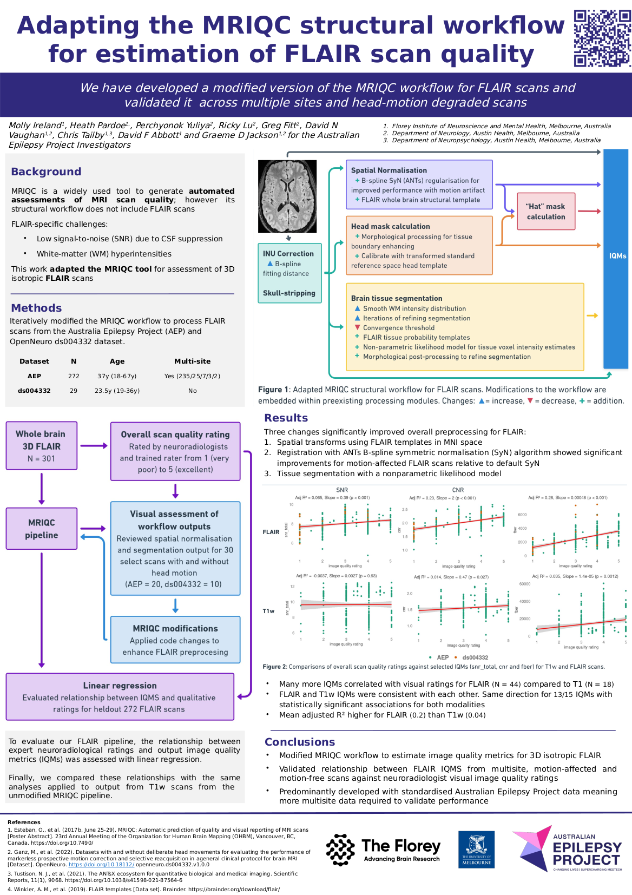

# FLAIR support for MRIQC

This repository extends the standard [MRIQC](https://github.com/poldracklab/mriqc) framework to support quality control and conversion workflows for 3D **FLAIR** MRI sequences.

## Issues, comments queries
Please log an issue on github or contact me at `molly.ireland@florey.edu.au`

## Version note:
The current main repository is a working version of the ongoing merge with the most recent MRIQC pipeline version 24. To access the original code used in the OHBM poster, please checkout on the branch `feature/mriqc-flair_v23.1.0`:

```
git checkout feature/mriqc-flair_v23.1.0
```

Please note that the current workflow with the most recent MRQIC pipeline has not yet been tested as extensively as the original pipeline. Results from this testing will be made available as this arises and documented here.

### Change log: mriqc-flair_v24
- **Likely change:** Reversion to MRIQC SpatialNormalization function given new ANTs settings files are outputting better segmentations


## Overview
As a common scan in clinical and research settings, this project was undertaken to extend the quantitative assessments of scan quality using the MRIQC framework for FLAIR. This project introduces:

- **FLAIR-specific image handling** added to core workflows
- Inclusion of FLAIR images in outputted MRQIC **quality control (QC) reports**

## OHBM Poster 2025

This work was presented at the Organization for Human Brain Mapping (OHBM) Annual Meeting.  
A pdf of this poster can be found in the [here](docs/mriqc-flair/OHBM_eposter_mriqcflair.pdf).



## How to Use
Running works the same as the original MRIQC — FLAIR files must follow BIDS naming conventions e.g. `sub-01_ses-01_FLAIR.nii.gz`

## Docker

### Build the Docker Container

Before running, you need to build the custom MRIQC Docker container. From the root of the project, run:

```bash
docker build -t mriqc-flair .
```
#### Run the participant level in subjects 001, 002, and 003:

```bash
docker run -it --rm \
  -v <bids_dir>:/data:ro \
  -v <output_dir>:/out \
  mriqc-flair \
  /data /out participant --participant_label 001 002 003
```

#### Run the group level and report generation on previously processed subjects:

```bash
docker run -it --rm \
  -v <bids_dir>:/data:ro \
  -v <output_dir>:/out \
  mriqc-flair \
  /data /out group
```

> **Note:** If the `--participant_label` argument is not provided, then all BIDS-compliant subjects will be processed and the group-level analysis will automatically be executed without needing to run the group command separately.

---

### Run MRIQC from a Local Development Environment

If you are running MRIQC from a local Python environment with FLAIR support added (e.g., via `pip install -e .`), run:

```bash
python3 -m mriqc.cli.run /path/to/bids_dataset /path/to/output participant \
  --modalities FLAIR \
  --no-sub
```
> Note: You must have AFNI, ANTs, and FSL installed and accessible in your $PATH for MRIQC to run correctly outside of the Docker container.

## Acknowledgements

This extension builds on the incredible work of the [MRIQC team](https://mriqc.readthedocs.io). FLAIR support was inspired by QC needs for the growing multisite cohort in the Australian Epilepsy Project.

## License

MIT License. See `LICENSE` for details. Updates made to `NOTICE` file.
